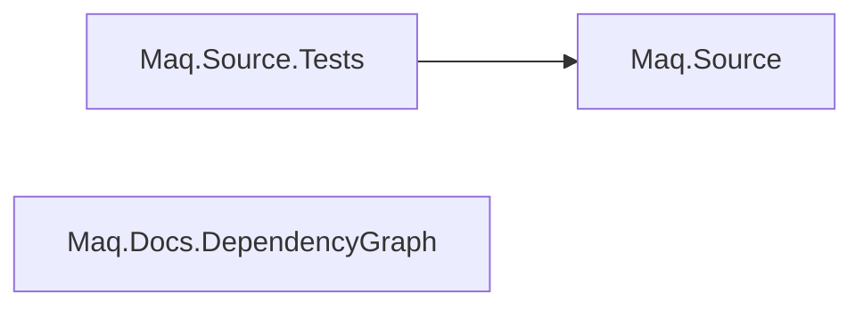

# Project dependencies

> [!NOTE]
> This page is generated automatically from the MSBuild project graph. Do not edit it manually.

Source solution: `Maq.slnx`

**Projects**: 3
**Project references**: 1

## Projects

| Project | Path | Dependencies |
| --- | --- | ---: |
| Maq.Source | `src/Maq.Source/Maq.Source.csproj` | 0 |
| Maq.Source.Tests | `tests/Maq.Source.Tests/Maq.Source.Tests.csproj` | 1 |
| Maq.Docs.DependencyGraph | `tools/Docs.DependencyGraph/Maq.Docs.DependencyGraph.csproj` | 0 |
